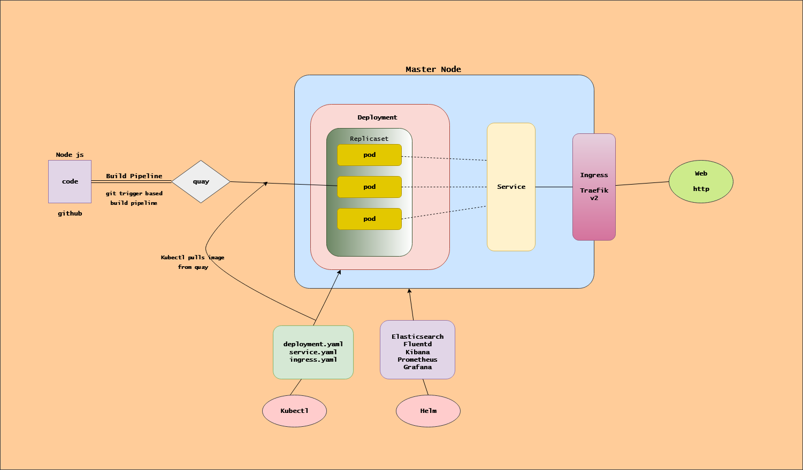
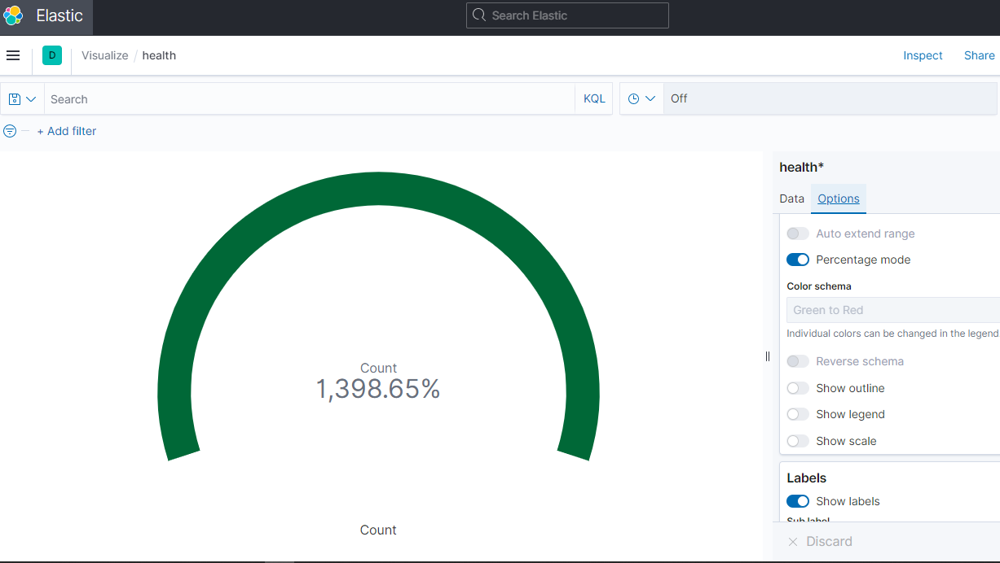
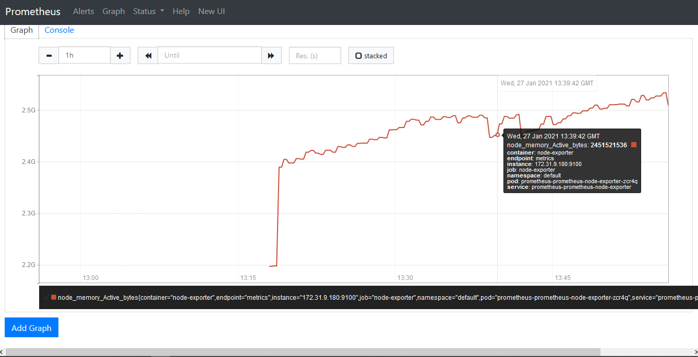
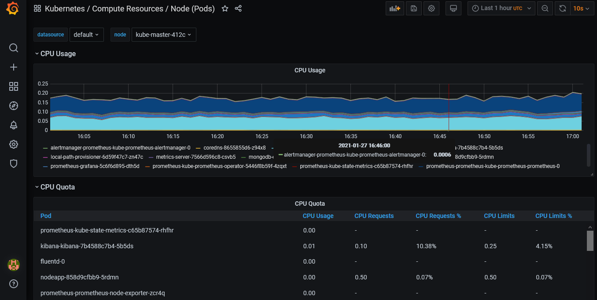
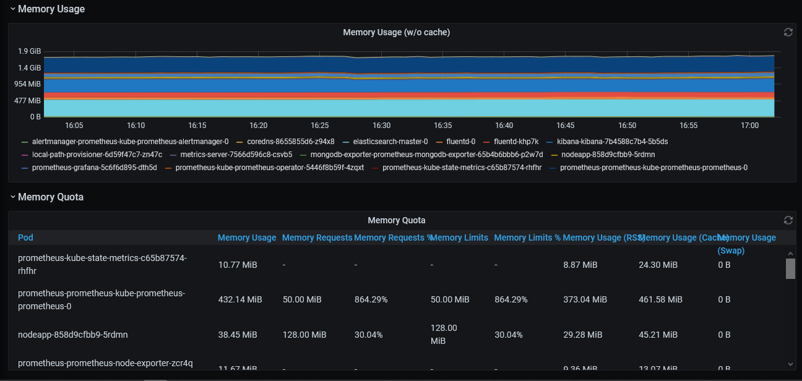
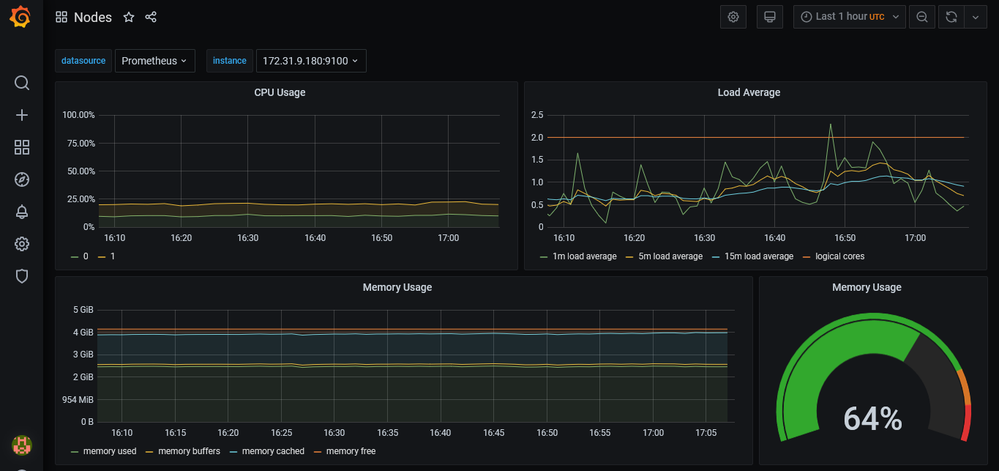
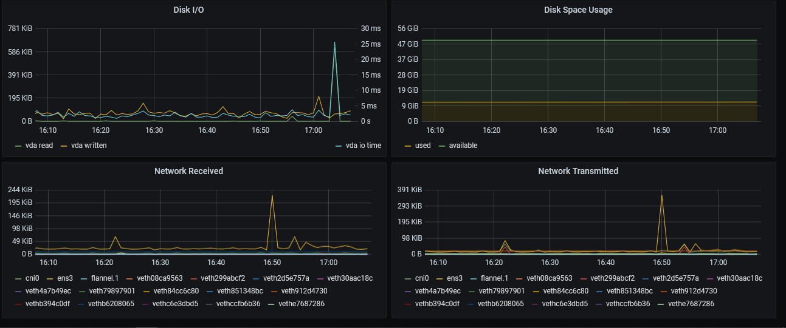

# Ecommerce-nodejs-app deployed in Kubernetes with logging(efk) & monitoring (prometheus) support
Ecommerce Nodejs application deployed in [Kubernetes](https://kubernetes.io) then, [Prometheus](https://prometheus.io/) , [Elasticsearch](https://www.elastic.co/), [Kibana](https://www.elastic.co/), [Fluentd](https://www.fluentd.org/) and [Grafana](https://grafana.com/) is used for monitoring and logging the application.

## Deployment

 - Create deployment file in the deployments directory and apply this command below
 - `kubectl apply -f node-deploy.yaml`
 - Expose service by creating a service yaml file in the services directory as
 - `node-service.yaml`
 - Get mapped port for the app
 - `kubectl get service`
 - Visit k8s cluster provider domain in the browser `http://b2659cf2-c5f9-404a-98a5-c789a9adf67b.k8s.civo.com/nodes/docs/` in my case.

## Services

 - Create services by applying this command below in the services directory
 - `kubectl apply -f node-service.yaml`
 - Get mapped port for the app
 - `kubectl get service`

## Secret

 - Create secret for credentials in nodejs app 
 - `kubectl create secret generic wondersecret --from-literal=nodesecret5=`

## Ingress

 - Create ingress yaml file in the ingress directory and apply it to k8s cluster as
 - `kubectl apply -f node-ingress.yaml`
 - Use a loadbalancer for ingress
 - In this project, I have used `traefik` 
 - Set host to a kubernetes service provider 
 - In this project, I have used `civo` 

## Logging using (efk)

- Create a separate helm repository to install elasticsearch and kibana 
- `helm repo add elastic https://Helm.elastic.co` 
- Create the files `values.yaml` and `values-kibana.yaml` to configure the values of `elasticsearch` and `kibana` for installation.
- Install elasticsearch and kibana using the following commands:
- `helm install elasticsearch elastic/elasticsearch -f values.yaml`
- `helm install kibana elastic/kibana -f values-kibana.yaml`
- Create a separate helm repository to install fluentd 
- `helm repo add bitnami https://charts.bitnami.com/bitnami`
- Install fluentd using the following command:
- `helm install fluentd bitnami/fluentd`
- Access Kibana locally using the following command:
- `kubectl port-forward deployment/kibana-kibana 5601`
- Check logs coming in kibana, you just need to refresh.
- Load and view the dashboard of the logs collected:

## Monitoring using (prometheus and grafana)
- Create a separate helm repository to install prometheus and grafana
- `helm repo add prometheus-community https://prometheus-community.github.io/helm-charts`
- `helm repo add stable https://kubernetes-charts.storage.googleapis.com/`
- Install prometheus and grafana using the following commands:
- `helm install prometheus prometheus-community/kube-prometheus-stack`

### Prometheus
- Access Prometheus using the following command:
- `kubectl port-forward service/prometheus-kube-prometheus-prometheus 9090`
- Graph of a query `node_memory_active_bytes` as 

### Grafana
- Access Grafana using the following command:
- `kubectl port-forward deployment/prometheus-grafana 3000`
- Dashboards containing data in time series graph
#### Kubernetes Pod Resources

#### Kubernetes Nodes

